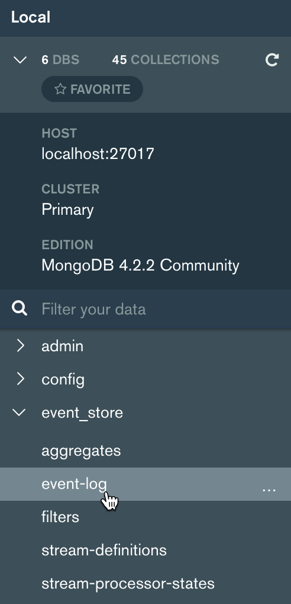
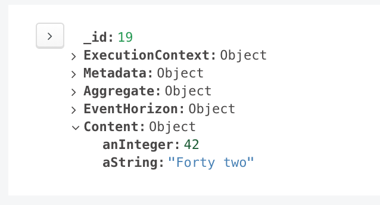

# JavaScript SDK

[](https://dolittle.visualstudio.com/Dolittle%20open-source%20repositories/_build/latest?definitionId=60&branchName=master)
[](https://badge.fury.io/js/%40dolittle%2Fsdk)

The repository holds the SDK for working with Dolittle for JavaScript.

## Requirements

This project relies on [NodeJS](https://nodejs.org/en/) and leverages [Yarn](http://yarnpkg.com/).
The code is written using [TypeScript](http://www.typescriptlang.org) and transpiles
to JavaScript as part of its building.

## Samples

In the [./Samples/Basic](./Samples/Basic) folder you'll find a basic sample showing how to work with the Dolittle SDK.

## Quickstart

**This quickstart is assuming TypeScript with decorator support enabled.**

You need to run the Dolittle runtime which also depends on a MongoDB configured in cluster-mode.
We've put together a [Docker Compose](https://docs.docker.com/compose/) setup that can be found [here](./Samples/Environments).

```shell
$ yarn add @dolittle/sdk
```

Then you can add the following to commit an event.

```typescript
import { Client } from '@dolittle/sdk';

const client = Client.default();
client.executionContextManager.currentFor('900893e7-c4cc-4873-8032-884e965e4b97');
client.commit({ someProperty:42 }, '88f25363-7ee9-4a6f-99c4-5f0e45495d30', '715eb922-ce14-48f2-b93b-f05d2b2a529b');
```

This gets you the default instance of the client. Dolittle is oriented around microservices and you'll notice that you
can also pass in a unique identifier for your microservice as a parameter to `default()`.

The `executionContextManager` call is to set the current tenant identifier, as Dolittle is a fully multi-tenant solution.
The runtime needs to be configured with a tenant and the MongoDB resource for the event storage, the environment configuration
has this already and you'll find examples of this in the [tenants.json](./Samples/Environments/tenants.json) and
the [resources.json](./Samples/Environments/resources.json) files.

The call to `commit()` uses the overload that takes 3 parameters. The first being the content (payload) of the event,
the second being a unique identifier for the source of the event. If used in relationship to a specific instance of an
object, this identifier should be the unique key for that instance. The third parameter is the unique identifier
identifying the type of the event, referred to as artifact identifier with Dolittle.

You can make this a bit more sophisticated by introducing a type for the event and decorating it with the
unique artifact identifier. Add a file called `MyEvent.ts` and put the following in it.

```typescript
import { artifact } from '@dolittle/sdk.artifacts';

@artifact('715eb922-ce14-48f2-b93b-f05d2b2a529b')
export class MyEvent {
    anInteger!: number;
    aString!: string;
}
```

This will create an association between the type and the artifact identifier, making it easier to use without having
to pass along the identifier on calls. Change the initial code as follows to make use of the new type:

```typescript
import { Client } from '@dolittle/sdk';
import { MyEvent } from './MyEvent';

const client = Client.default();
client.executionContextManager.currentFor('900893e7-c4cc-4873-8032-884e965e4b97');

const event = new MyEvent();
event.anInteger = 42;
event.aString = 'Forty two';
client.commit(event, '88f25363-7ee9-4a6f-99c4-5f0e45495d30');
```

Using a MongoDB tool, such as [Compass](https://www.mongodb.com/products/compass), you can navigate the event store
and find the event you just published.

Navigate to the `event-log` collection:



In it you'll find the document for your committed event:



As you can see, there is also metadata associated with the event.

## Building

At the root level of the repository, to restore all node modules, run the following:

```shell
$ yarn
```

To build, run the following at the root level of the repository:

```shell
$ yarn build
```

To run the test harness:

```shell
$ yarn test
```
